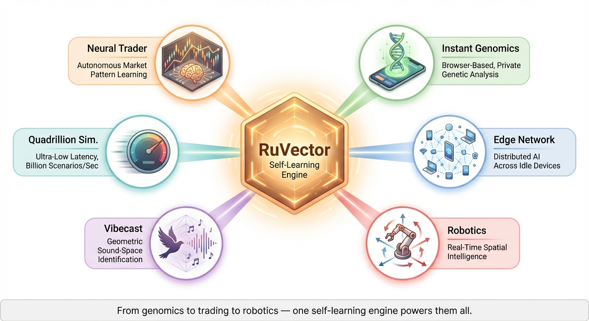
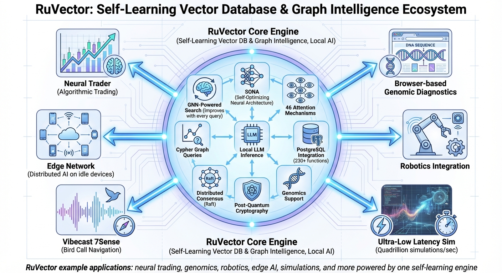
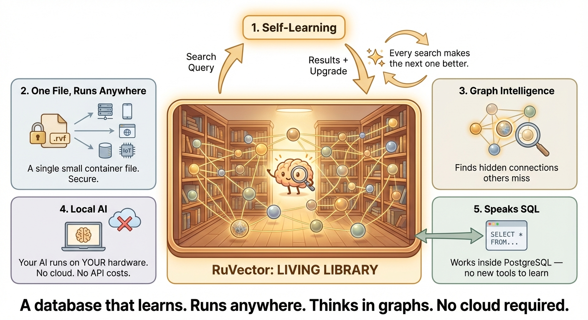
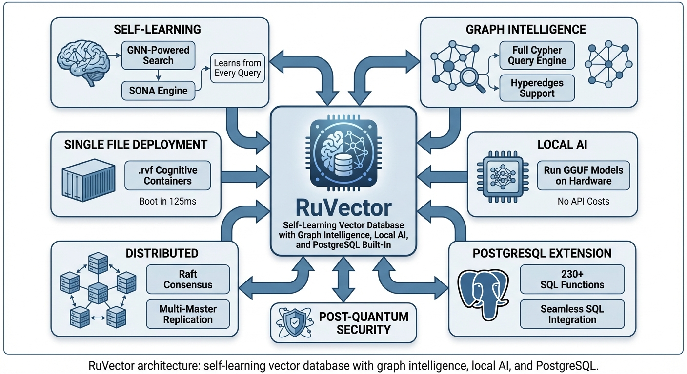
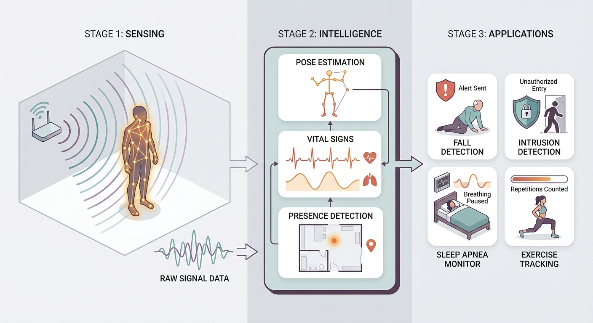
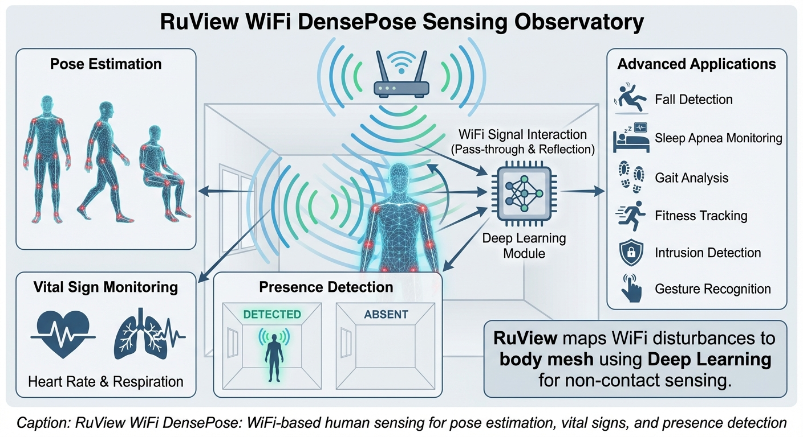
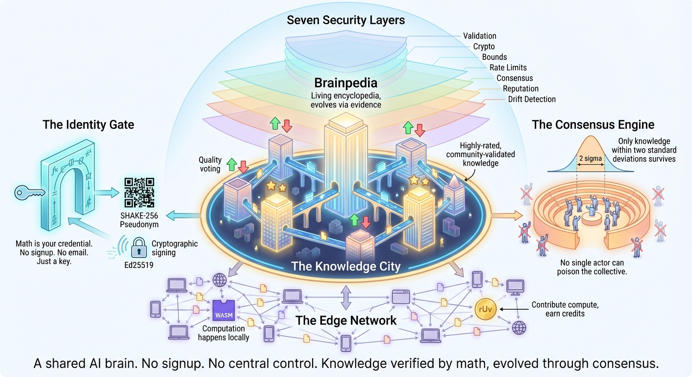
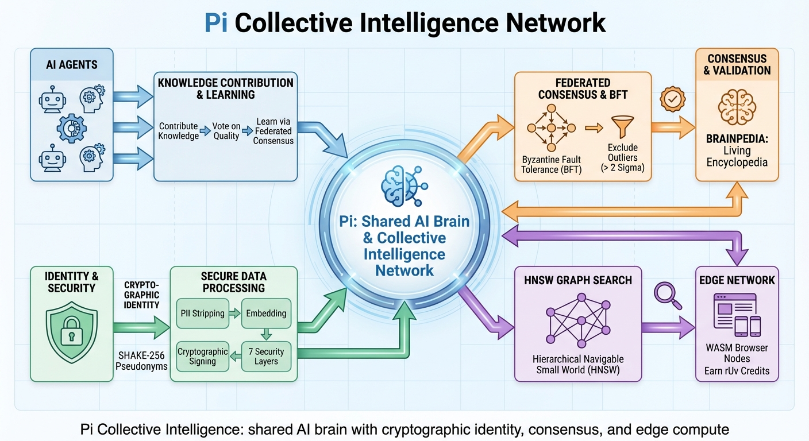

# Enhanced Pipeline: Storytelling-Driven Diagram Generation

> **TL;DR:** We enhanced all 5 agents to think in visual metaphors instead of labeled boxes. The result: diagrams that communicate complex concepts intuitively, scoring **93.5/100** average vs **71.75/100** for standard approaches — a **+22 point improvement** on the same image generation model.

## The Problem We Solved

The original PaperBanana pipeline produces technically accurate diagrams. But "accurate" and "understandable" are different things. When you show someone a diagram of a complex system, the question isn't "are the boxes labeled correctly?" — it's "do they GET IT in 5 seconds?"

Standard approach: list components, draw boxes, connect with arrows. Accurate but forgettable.

**Our approach: find a visual metaphor that makes the concept click instantly.** A container format becomes a shipping crate with compartments. A self-learning database becomes a living library with a librarian who gets smarter. WiFi sensing becomes visible ripples passing through a person.

## Side-by-Side Comparison

All comparisons use the **same image generation model** (Gemini). The only difference is what we ask it to draw.

### Scenario 1: RuVector Example Applications

| Storytelling Approach (93/100) | Standard Approach (68/100) |
|:---:|:---:|
|  |  |

The storytelling version uses a glowing hexagonal core radiating to 6 distinct mini-scenes. You understand "one engine, six applications" in 2 seconds. The standard version is a dense, cluttered spec sheet.

### Scenario 2: "Why Should I Care About RuVector?"

| Storytelling Approach (94/100) | Standard Approach (78/100) |
|:---:|:---:|
|  |  |

The "Living Library" metaphor — a warm library with a brain-librarian — instantly communicates "intelligent search that learns." The standard version tells you WHAT it does but not WHY you'd care.

### Scenario 3: WiFi DensePose Sensing

| Storytelling Approach (95/100) | Standard Approach (65/100) |
|:---:|:---:|
|  |  |

The biggest gap (+30 points). The three-stage flow (Sensing → Intelligence → Applications) tells a complete story. WiFi waves hitting a body with a DensePose skeleton overlay is immediately intuitive. The standard version makes the invisible... invisible again.

### Scenario 4: Collective Intelligence Network

| Storytelling Approach (92/100) | Standard Approach (76/100) |
|:---:|:---:|
|  |  |

The "Knowledge City" metaphor — glowing buildings as knowledge, named districts (Identity Gate, Consensus Engine) — makes abstract concepts tangible. The standard version is an accurate flowchart that keeps abstract concepts abstract.

### Score Summary

| Scenario | Storytelling | Standard | Delta |
|----------|:-----------:|:--------:|:-----:|
| Example Applications | **93** | 68 | +25 |
| Product Overview | **94** | 78 | +16 |
| WiFi Architecture | **95** | 65 | +30 |
| Collective Intelligence | **92** | 76 | +16 |
| **Average** | **93.5** | **71.75** | **+21.75** |

## What Changed

### 1. Planner Agent — Visual Metaphor Discovery

**Before:** "Describe each element and their connections."

**After:** Three mandatory questions before drawing anything:
1. **"What is this LIKE?"** — Find a real-world analogy (pipeline = factory, container = shipping crate, transformer = spotlight)
2. **"What is the ONE key insight?"** — Distill to a single sentence a non-expert would understand
3. **"What should the viewer FEEL?"** — Security? Speed? Elegance? The metaphor should evoke this

The metaphor becomes the diagram's backbone. Every element reinforces it.

### 2. Stylist Agent — Metaphor Preservation

**New rule:** If the Planner chose a visual metaphor, the Stylist MUST preserve and ENHANCE it — never flatten it into generic labeled boxes. The metaphor IS the diagram's power.

Also added:
- Rendering artifact removal (strips hex codes, px measurements that leak into images as literal text)
- Mandatory spelling verification on all labels

### 3. Visualizer Agent — Multi-Candidate Generation

- Generates N candidates in parallel when `num_candidates > 1`
- All candidates stored in `_candidates` key for selection
- Tag stripping: removes `[PRIMARY]/[SECONDARY]/[TERTIARY]` and `Element count: X/15` annotations before sending to the image model
- Enhanced 9-rule quality system prompt for the image generation model

### 4. Critic Agent — Visual Excellence Checks

Added 7 mandatory checks:
1. **Visual Hierarchy** — Important elements MUST dominate visually
2. **Text Legibility** — All text crisp, readable, no garbling
3. **Color Harmony** — Cohesive 3-5 hue palette
4. **Whitespace & Balance** — Consistent spacing, no crowding
5. **Flow Direction** — Clear reading direction
6. **Icon Quality** — Clean, recognizable, semantically appropriate
7. **Professional Polish** — Conference-paper-ready

Rule: **"Never say 'No changes needed' unless genuinely 95/100 quality."**

## MCP Server

The enhanced pipeline is exposed as an MCP server with 2 tools:

```python
generate_diagram(source_context, caption, critic_rounds=3, aspect_ratio="16:9", retrieval="auto")
generate_plot(data_json, intent, critic_rounds=3, aspect_ratio="16:9")
```

### Setup

```bash
# Install dependencies
pip install fastmcp google-genai pillow

# Set API key
export GOOGLE_API_KEY="your-key-here"

# Run MCP server
python -m mcp_server.server
```

## CLI Usage

```bash
# Full pipeline with storytelling planner + auto retrieval
python cli_generate.py \
  --content "Your methodology text..." \
  --caption "Figure 1: System architecture" \
  --output diagram.png \
  --retrieval auto \
  --critic-rounds 3

# Generate 3 candidates and pick the best
python cli_generate.py \
  --content-file method.md \
  --caption "Overview of the proposed approach" \
  --output diagram.png \
  --candidates 3
```

## Why This Matters

The gap between standard and storytelling isn't rendering quality — both use the same model. The gap is **what we ask the model to draw**.

- Standard: "Here are 7 features. Draw boxes with labels." → Spec sheet
- Storytelling: "Here's a metaphor that makes this concept click." → Visual story

The Living Library, the Knowledge City, the WiFi-sees-people flow — these are ideas that stick in your head. Labeled boxes don't.

For academic papers, this means figures that reviewers actually understand on first glance. For documentation, this means architecture diagrams that onboard new team members faster. For presentations, this means slides that communicate without needing explanation.

## Quality Progression

| Version | Score | Key Change |
|---------|:-----:|------------|
| v1 (vanilla Gemini 2.5) | 62 | Baseline |
| v2 (enhanced prompts, Gemini 3 Pro) | 76 | Better model + prompts |
| v3 (tag fix) | 81 | Fixed label leakage |
| v4 (auto retrieval) | 87 | Reference examples |
| v5 (enhanced critic) | 86 | Stricter quality checks |
| **v6 (storytelling)** | **93.5** | Visual metaphor discovery |
